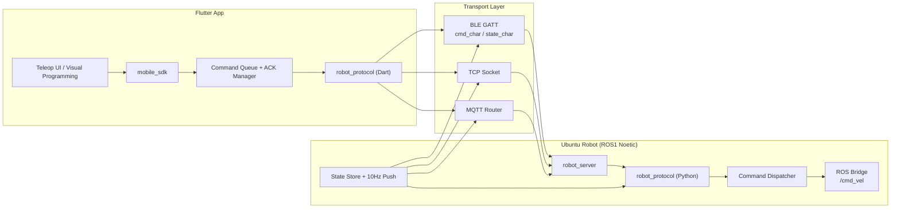

# Phase 0 - Robot OS Lite 设计

本文严格对应 `prd.md` 中的 Phase 0 要求，只做设计确认，不讨论业务细节代码。

## 1. 完整系统架构图



### 模块职责

- `apps/robot_app`：提供操作 UI 与图形化编程界面。
- `mobile_sdk`：统一提供 `RobotClient`、命令队列、ACK 逻辑、状态流。
- `protocol`：定义跨语言统一的帧格式、CRC、编解码与流解包器。
- `robot_server`：统一接入 BLE/TCP/MQTT，完成协议解析、ACK、ROS1 分发与状态广播。

## 2. BLE / TCP / MQTT 数据流

### 控制流

```mermaid
sequenceDiagram
    participant App as Flutter App
    participant Queue as Command Queue
    participant Link as BLE/TCP/MQTT
    participant Server as robot_server
    participant ROS as ROS /cmd_vel

    App->>Queue: enqueue(move / stand / sit / stop)
    Queue->>Link: send CMD(seq)
    Link->>Server: binary frame
    Server->>Link: ACK(seq)
    Server->>ROS: dispatch command
    Link->>Queue: ACK(seq)
    Queue->>Queue: release inflight and send next
```

### 状态流

```mermaid
sequenceDiagram
    participant Robot as robot_server
    participant Link as BLE/TCP/MQTT
    participant App as Flutter App

    Robot->>Robot: sample state at 10Hz
    Robot->>Link: STATE(seq)
    Link->>App: binary state frame
    App->>App: decode -> stateStream
```

### Transport 约束

- BLE：机器人端作为 GATT Server，`cmd_char` 接收 `write without response`，`state_char` 负责 `notify`。
- TCP：机器人端监听 socket，App 端长连接发送流式二进制数据。
- MQTT：
  - `robot/{id}/control`：App -> Robot，承载 `CMD`
  - `robot/{id}/state`：Robot -> App，承载 `STATE` 与 `ACK`
  - `robot/{id}/event`：Robot -> App，承载 JSON 事件

## 3. ROS1 控制路径设计

控制链路采用“接收即缓存、固定频率同步”的设计，避免网络抖动直接影响底盘控制。

### 路径

1. `robot_server` 收到 `CMD` 帧。
2. 协议层完成 CRC 和 payload 解析。
3. `CommandDispatcher` 将 `MOVE` 写入最新运动设定，将 `DISCRETE` 作为离散事件执行。
4. `RosControlBridge` 以 10Hz 发布 `/cmd_vel`。

### 映射

- `vx -> Twist.linear.x`
- `yaw -> Twist.angular.z`
- `vy` 默认保存在控制状态中，若机器人控制器支持横移，可映射到 `Twist.linear.y`

### 离散命令处理

- `stand`：转发为站立事件或服务调用占位
- `sit`：转发为下蹲事件或服务调用占位
- `stop`：立即清零 `vx / vy / yaw`

## 4. 协议设计确认（字段级）

### 帧结构

| 字段 | 字节数 | 说明 |
| --- | ---: | --- |
| Magic | 2 | 固定 `0xAA55` |
| Type | 1 | `0x01 CMD` / `0x02 STATE` / `0x03 ACK` |
| Seq | 1 | 0-255 循环递增 |
| Len | 2 | Little Endian，payload 长度 |
| Payload | N | 业务负载 |
| CRC | 2 | CRC16-CCITT-FALSE，覆盖 `Type + Seq + Len + Payload` |

### Endian 与缩放

- 整数统一使用 Little Endian
- 速度/姿态统一使用 `实际值 * 100`
- `Seq` 由发送端自增，接收端用 payload 中的 ACK seq 或 Header seq 做匹配

### CMD Payload

#### MOVE (`cmd_id = 0x01`)

| 字段 | 类型 | 字节数 |
| --- | --- | ---: |
| cmd_id | `uint8` | 1 |
| vx | `int16` | 2 |
| vy | `int16` | 2 |
| yaw | `int16` | 2 |

#### DISCRETE

| 命令 | `cmd_id` |
| --- | ---: |
| stand | `0x10` |
| sit | `0x11` |
| stop | `0x12` |

### STATE Payload

| 字段 | 类型 | 字节数 |
| --- | --- | ---: |
| battery | `uint8` | 1 |
| roll | `int16` | 2 |
| pitch | `int16` | 2 |
| yaw | `int16` | 2 |

### ACK Payload

| 字段 | 类型 | 字节数 |
| --- | --- | ---: |
| seq | `uint8` | 1 |

### 粘包 / 半包策略

- 采用流式 decoder，逐字节查找 `0xAA55`
- 读到完整头部后根据 `Len` 判断是否等待更多字节
- CRC 失败后左移 1 字节重新搜帧，保证能从坏流中自恢复
- 支持 TCP 粘包、MQTT 分片重组以及 BLE 多次 write 拼流

## 5. Command Queue 设计

采用“单 inflight + latest move slot + discrete FIFO”。

### 内部结构

- `inflight`：当前已发送、待 ACK 的命令
- `move_slot`：只保留最新的移动命令
- `discrete_queue`：离散命令 FIFO

### 出队规则

1. 若存在 `inflight`，新命令只入队，不会并发发送
2. 若无 `inflight`：
   - 先发 `discrete_queue` 头部
   - 否则发 `move_slot`

### 设计原因

- `move` 是连续控制，旧值没有价值，所以覆盖旧命令
- `stand / sit / stop` 是状态切换，必须按顺序执行
- 单 inflight 让 ACK / 重传模型简单稳定，适合 BLE 与弱网场景

## 6. ACK + 重传机制设计

### 发送端

- 仅 `CMD` 参与 ACK 与重传
- 发送后进入 `WAIT_ACK`
- 100ms 内未收到 ACK，则重发
- 最多重发 3 次，超过则标记命令失败并释放 inflight

### 接收端

- CRC 正确且 payload 可解析后立即回 ACK
- 服务端记录最近窗口内的 `seq`，重复包只回 ACK，不重复执行业务动作

### 时序状态机

```text
IDLE
  -> SEND
  -> WAIT_ACK
  -> (ACK) IDLE
  -> (TIMEOUT) RETRY
  -> (retry < 3) WAIT_ACK
  -> (retry == 3) FAILED -> IDLE
```

## 7. 风险分析

### BLE / BlueZ

- GATT Server 需要系统级 BlueZ、Adapter 权限与 D-Bus 注册，部署环境必须是 Linux 机器人端
- App 侧 BLE 插件与系统权限在 Android / iOS 上存在差异，需要单独调试

### ROS1

- ROS1 Noetic 标准环境是 Ubuntu 20.04 + Python 3.8，本机 Python 3.13 仅用于开发与纯逻辑测试
- 真机接入前需要用目标环境验证 `rospy`、`geometry_msgs`、topic 连通性

### 可靠性

- `Seq` 只有 1 字节，长时运行必须结合“最近窗口”去重，不能做无限集合
- 若状态推送与 ACK 复用同一路下行，App 侧必须按 `Type` 区分

### 拓展性

- 当前协议字段紧凑，适合 BLE；若后续扩展大 payload，可在 `Payload` 中再做 TLV 或版本字段

## 8. 确认开发顺序

尽管 PRD 中强调“BLE 必须先完整实现”，真正落地时仍需先把它依赖的协议底座搭好。建议顺序如下：

1. `protocol`：先固定帧格式、CRC、流解包与跨语言模型
2. `robot_server`：命令分发、ACK、状态循环
3. BLE：BlueZ GATT Server 与 `cmd_char/state_char`
4. TCP：socket server 接入同一套协议解析
5. MQTT：Topic Router 与协议分发
6. ROS1：`/cmd_vel` 10Hz 控制同步
7. Flutter SDK：`RobotClient` + queue + transport
8. App 内图形化动作引擎
9. 最后做端到端联调与真机参数校准

